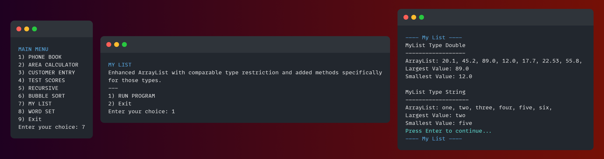

# CST 250 Projects

> Computer Science II - Further exploration of Object-Oriented Programming concepts and computer science fundamentals.

This repository contains a collection of my CST 250 Java assignments highlighting practical application of Java programming skills. These projects were completed as part of my Computer Science coursework.

## Contents



Source codes for these projects are found in the folder "src".

| Program                | Description                                                                                         | Source                                           |
|------------------------|-----------------------------------------------------------------------------------------------------|--------------------------------------------------|
| 1. **Phone Book**      | Object-oriented phonebook application with ArrayList storage.                                       | [Source](src/PhoneBook/PhoneBook.java)           |
| 2. **Area Calculator** | Area calculator app for common shapes (circles, rectangles, and cylinders).                         | [Source](src/AreaCalculator/AreaCalculator.java) |
| 3. **Customer Entry**  | Object-oriented customer entry application demonstrating class inheritance.                         | [Source](src/CustomerEntry/Main.java)            |
| 4. **Test Scores**     | Test scores average calculator with error handling.                                                 | [Source](src/CustomerEntry/Main.java)            |
| 5. **Recursive**       | Recursive linear search implementation that demonstrates basics of recursion.                       | [Source](src/Recursive/Recursive.java)           |
| 6. **Bubble Sort**     | Recursive bubble sort implementation and visualizer.                                                | [Source](src/BubbleSort/BubbleSort.java)         |
| 7. **My List**         | Enhanced ArrayList with comparable type restriction and added methods specifically for those types. | [Source](src/MyList/Main.java)                   |
| 8. **Word Set**        | Program tokenizes a string and prints out all unique words in ascending order.                      | [Source](src/WordSet/WordSet.java)               |

## How to run

1. **Clone the Repository:**
   ```shell
   git clone https://github.com/ARey-H39/CST150-Projects.git
   ```
2. **Compile and Run:**
   * _Using a Command Line:_
     ```shell
     cd CST250-Projects
     javac Main.java
     java Main
     ```
   * _Using an IDE:_ Import the project into your preferred IDE and run the desired program.